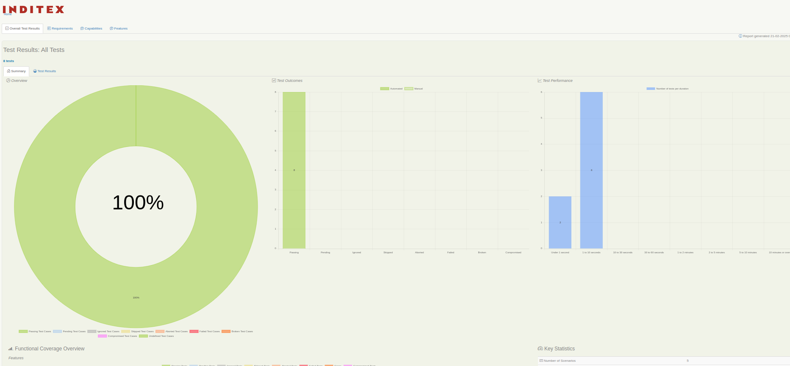

# Automation Project

## Use Maven

Open a command window and run:

    mvn clean verify

This command will run all the tests

## Running scenarios by tags

With Cucumber framework, you need to use the cucumber.options system property for tests filtering:

    mvn clean verify -Dtags="Web"

Run ApiRest Test by filtering:

    mvn clean verify -Dtags="@ApiPets"

## Simple test contexts
Run your tests using the Chrome WebDriver, providing a context called "chrome"

     mvn verify -Dcontext=chrome -Dwebdriver.driver=chrome

## Adding more readable tags
Serenity will add a "context" tag to each of your tests, but you might want to make your reports even clearer by
adding a more meaningful tag. You can do this using the "injected.tags" system property:

    mvn verify -Dcontext=chrome -Dwebdriver.driver=chrome -Dinjected.tags="browser:chrome" 

## Aggregating test results

Once the tests have completed, open a command window and run:

    mvn serenity:aggregate -Dserenity.outputDirectory=serenity-reports

This command will generate the report that it is going to be in the following path:

`serenity-report`

## Viewing the reports

The command provided above will produce a Serenity test report in the `serenity-reports` directory. Go take a look!

